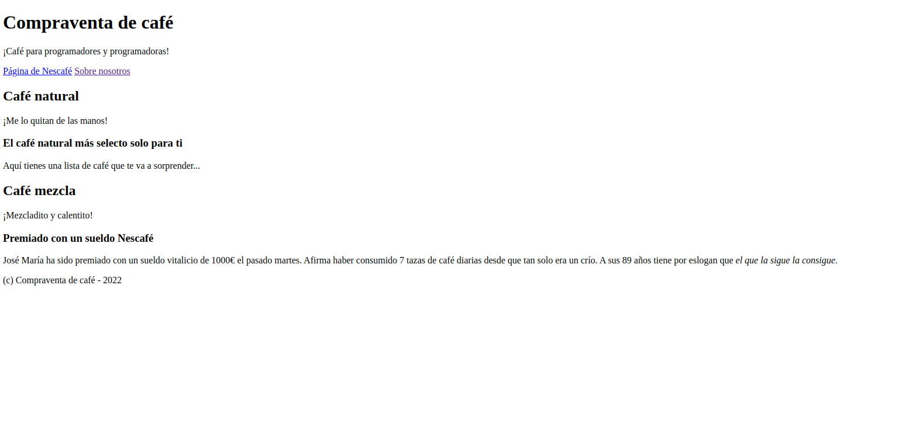
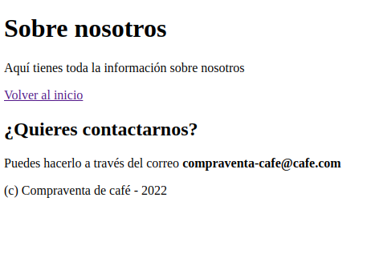

# Ejercicio 2

Diseña el html de las dos páginas que encontrarás en las imágenes de este mismo directorio.
Recuerda que no hay una única forma de hacer las cosas, así que hazlo como tú lo consideres
correcto.

Recuerda que debes agregar un enlace a la página oficial de Nescafé y un segundo enlace que
conecte ambas páginas entre sí, es decir, desde el `index` debemos poder navegar a `about`
y viceversa.

