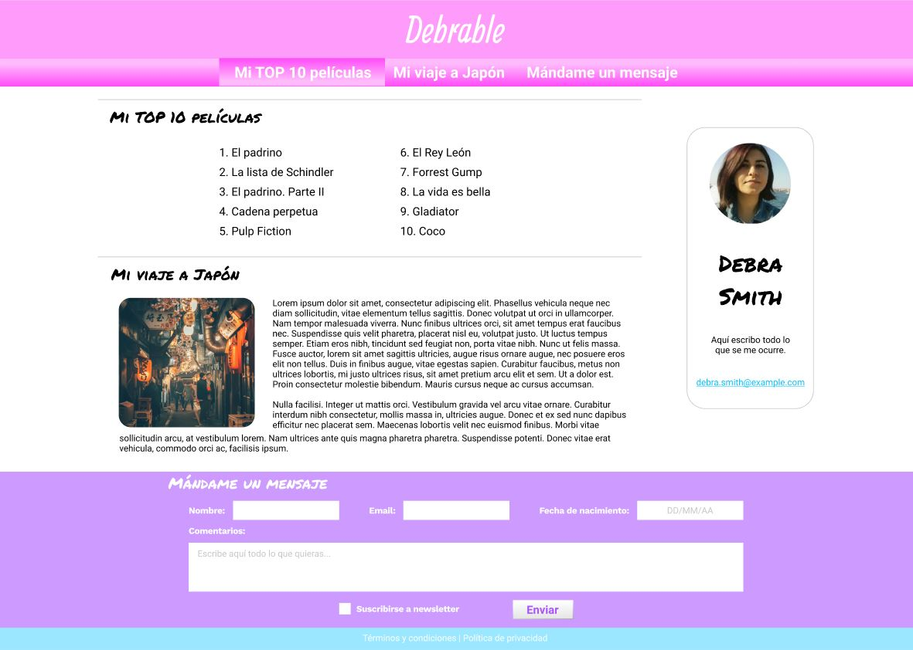
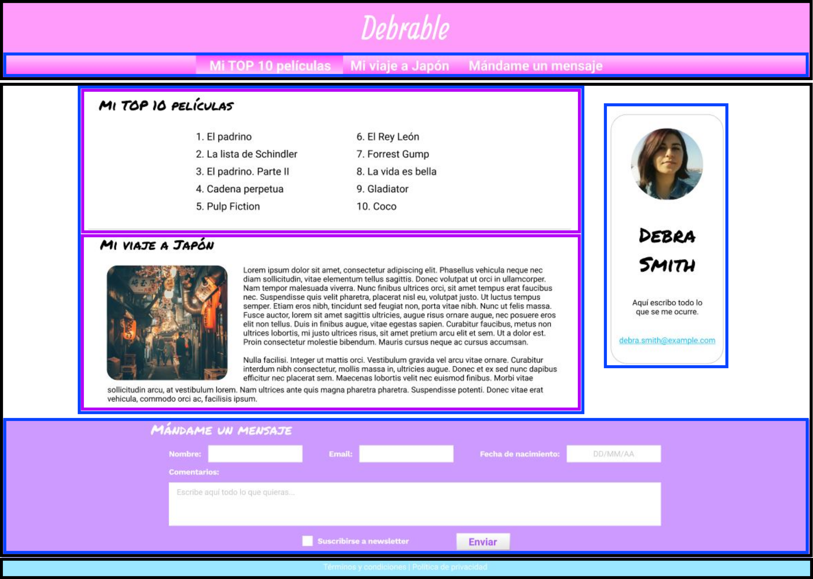

# Ejercicio 2

Crea un `index.html` para simular una estructura como la del ejemplo, siguiendo el esquema de más abajo (solo señala los bloques principales):

Requisitos:

- Los labels del formulario deben estar asociados mediante la propiedad _for_.
- El nombre, el email y la fecha de nacimiento son campos obligatorios.
- El menú debe funcionar (lleva a las distintas partes del mismo documento).
- Las imágenes pueden ser locales o externas, pero deben verse correctamente.

No se tendrá en cuenta:

- El contenido de los textos.
- El contenido de las imágenes.
- La estética en general.

Recuerda que es un ejercicio de HTML, por lo que **debes olvidar la estética final**.

El resultado final debe funcionar correctamente ejecutándolo con live server y no dar ningún error en el [Validador de HTML de la W3](https://validator.w3.org/nu/#textarea)
