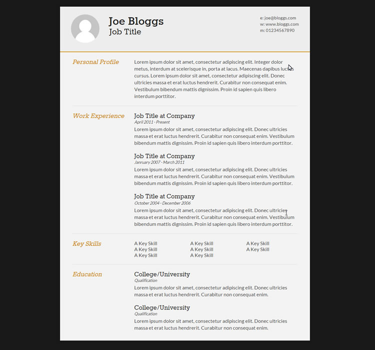

# Ejercicio 3

Edita el fichero `index.html` para que muestre un curriculum con el siguiente aspecto

El HTML y CSS resultantes deben ser validados por los validadores de la W3 y no dar ningún error.

[Validador de HTML de la W3](https://validator.w3.org/#validate_by_input)
[Validador de CSS de la W3](https://jigsaw.w3.org/css-validator/#validate_by_input)

Dado que no hemos visto como posicionar los elementos en el documento web no importa si algún elemento no queda exactamente donde deberían.