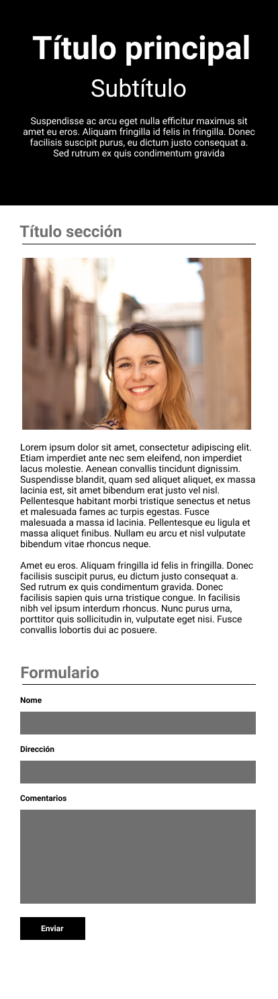

# Creación de un layout responsive

Edita el fichero `index.html` para que muestre una web que se adapte al tamaño de la pantalla y que represente este diseño:

## Móviles

## Escritorio

El CSS resultante debe ser validado por el [validador de CSS de la W3](https://jigsaw.w3.org/css-validator/#validate_by_input) y no dar ningún error.
